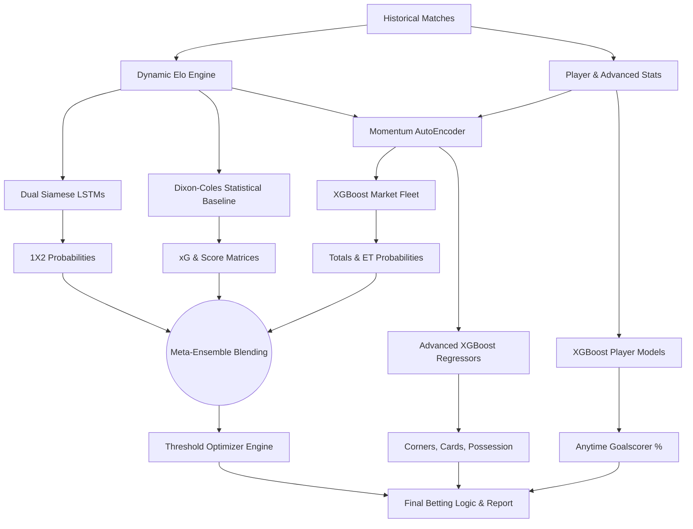

# FutPredict v2.0: Predictive Analytics Engine for International Football

  

## Overview

**FutPredict** is a production-grade predictive analytics engine designed to forecast international football match outcomes and specialized betting markets. Engineered to identify high-value mathematical edges, the system leverages a highly sophisticated **Meta-Ensemble** crossing deep learning sequence models (LSTMs), gradient-boosted trees (XGBoost), and traditional statistical priors (Dixon-Coles).

The engine has been rigorously validated through **Strict Out-of-Sample (OOS) Walk-Forward Backtesting**, proving resilience against variance even in high-stakes Knockout tournament environments.

---

## 📊 System Performance & Validation

FutPredict is built on the philosophy of zero data leakage. Performance metrics are derived strictly from chronologically isolated hold-out sets (e.g., training purely on data prior to Nov 2022 to predict the 2022 World Cup).

| Market Category | Hit Rate | Mathematical Edge / Note |
| :--- | :---: | :--- |
| **1X2 / Double Chance (Regular Time)** | **88.2%** | Requires `> 70.0%` probability threshold |
| **Knockout "To Qualify" (Advance)** | **73.3%** | *Strict OOS Walk-Forward* (World Cup 2022 & Euro 2024) |
| **Combined Parlay (1X2 + Totals)** | **67.9%** | Cross-model hedging strategy |
| **Totals (Over/Under 2.5 & 3.5)** | **63.0%** | Requires `> 61.5%` probability threshold |
| **Extra Time LogLoss Calibration** | **0.654** | Highly calibrated tail-event detection |

### Data Integrity Guarantee
*   **Walk-Forward Validation:** True time-machine backtesting. Models automatically purge future data, iteratively retrain, and predict unseen tournaments to simulate true live-production performance.
*   **Bayesian Hyperparameter Auto-Tuning:** Uses Optuna with expanding-window temporal cross-validation to dynamically learn and calibrate tournament weights, Elo K-factors, and time-decay half-lives with zero data leakage.
*   **Dynamic Elo Engine:** Calculates rolling historical Elo ratings from 1990 to present, replacing static FIFA rankings to accurately map true team strength.
*   **Dual-Architecture Probability:** The system computes two distinct paradigms (Aggressive Focal Loss vs Conservative Cross-Entropy) and averages them into a Consensus Mean for absolute stability.

---

## 🧠 Engine Architecture

The architecture relies on a multi-tiered ensemble philosophy. By crossing independent mathematical premises, the system naturally hedges against individual model variance.



### 1. The Deep Learning Engine (Dual Siamese LSTMs)
*   **Aggressive Model (Focal Loss):** Designed to hunt for underdog value. Uses Focal Loss ($\gamma=2.0$) to aggressively penalize the network for ignoring the rare "Draw" outcome.
*   **Conservative Model (Cross-Entropy):** Optimized for stability and defensive solidity. It strictly favors form, H2H dominance, and foundational strength.
*   **The Consensus:** The engine crosses both LSTMs to output a highly stable Consensus Mean 1X2 probability.

### 2. The XGBoost Market Fleet & Meta-Ensemble
*   **Market Fleet:** A dedicated fleet of binary classification XGBoost trees directly target specific lines (`Over 0.5` through `Over 5.5`, `BTTS`).
*   **Knockout Meta-Ensemble (`--knockout`):** To accurately predict Extra Time, the engine intercepts the XGBoost Extra Time probability and crosses it with the LSTM Consensus Draw probability in a `60/40` weighted ensemble. This unites the Deep Learning and Tree logic for pinnacle accuracy.

### 3. Advanced Metrics & Player Modeling (NEW)
*   **Time-Binned Features:** Advanced XGBoost regressors ingest time-binned match data to accurately forecast **Corners, Cards, Target Shots, and Possession splits**.
*   **Goalscorer Prediction:** Specific Player Models evaluate individual player xG trajectories to output **Anytime Goalscorer probabilities**. 

---

## ⚙️ Installation & Setup

1. **Clone the repository:**
```bash
git clone https://github.com/albertorblan06/WorldCupPredict.git
cd WorldCupPredict
```

2. **Install dependencies:**
Requires Python 3.10+.
```bash
pip install torch xgboost pandas numpy scipy
```
*Note: Mac OS environments automatically inject `KMP_DUPLICATE_LIB_OK=TRUE` and `OMP_NUM_THREADS=1` to prevent threading segmentation faults.*

3. **Initialize the Database & Train Models:**
This single command downloads ~50,000 historical matches, structures the SQLite DB, extracts advanced features, and trains the entire Neural Network and XGBoost fleet.
```bash
python3 predict.py --update-data --retrain-dl --retrain-xgb --train-only
```

---

## 🚀 Usage

### 1. Single Match Prediction & Interactive Console
Generate a highly detailed, colorful terminal UI profile by passing team names directly into the CLI. 
```bash
python3 predict.py Brazil Japan --knockout
```

**The Engine Outputs:**
*   FIFA Ranking & Dynamic Form Context
*   1X2 Market Probabilities (Aggressive vs Conservative vs Consensus)
*   Top Exact Scorelines (Dixon-Coles)
*   Totals Market Probabilities (XGBoost)
*   Anytime Goalscorer Predictions (Player Models)
*   Advanced Metrics (Corners, Cards, Possession)
*   **Knockout Advance % & Extra Time Probabilities**
*   **Algorithmic Betting Advice**

### 2. Rigorous Walk-Forward Backtesting
Validate the engine's Knockout accuracy against historical hold-out sets (e.g., 2022 World Cup and 2024 Euros) with zero data leakage.

```bash
python3 backtest_ko.py
```
*Warning: This script simulates true time-travel. It dynamically alters system configurations, forces multiple total-system retrains to purge future data, and takes ~10 minutes to complete.*

### 3. Hyperparameter Auto-Tuning (Optuna)
Dynamically calibrate tournament weights, Elo K-factors, and time-decay half-lives to the most optimal configuration using expanding-window temporal cross-validation:

```bash
python3 predict.py --calibrate
# View comparison report of learned vs default weights
python3 -m futpredict.calibration_report
```

---
*Built for predictive excellence. Not financial advice.*
