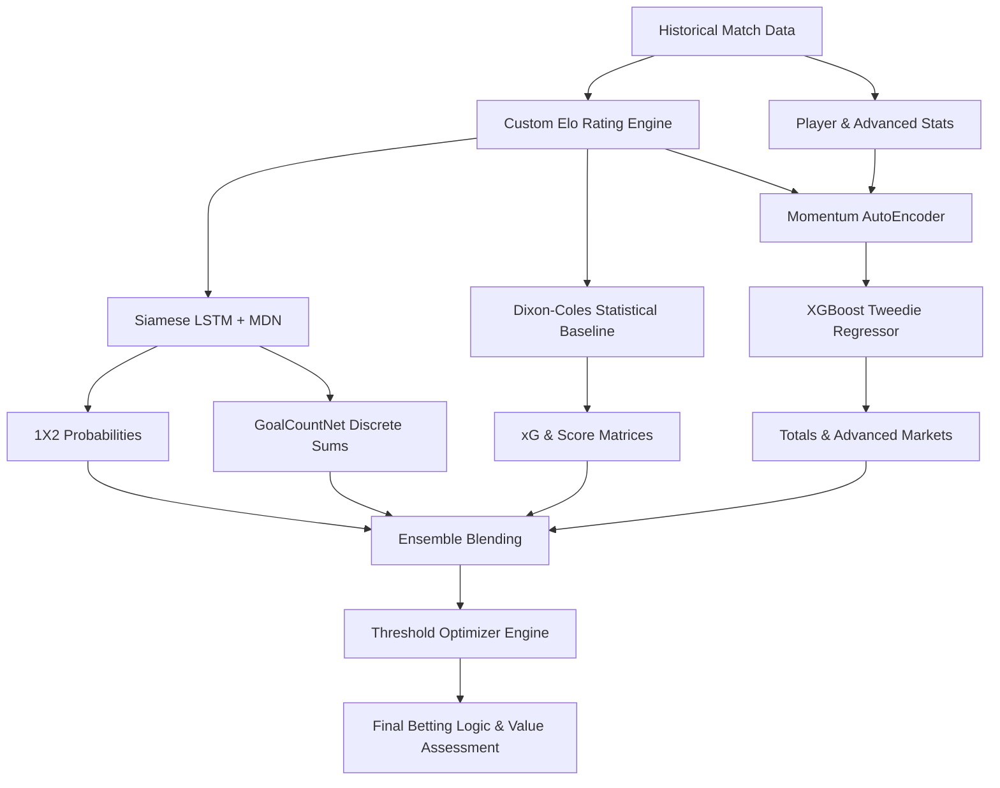

# FutPredict v2.0: Predictive Analytics Engine for International Football

## Overview

FutPredict is a production-grade predictive analytics engine designed to forecast international football match outcomes and specialized betting markets. Engineered to identify high-value mathematical edges, the system leverages a sophisticated ensemble of deep learning sequence models, gradient-boosted trees, and traditional statistical priors.

The engine has been rigorously validated through temporally-isolated batch testing (strict hold-out sets preventing future data leakage), achieving an **88.2% empirical hit rate on 1X2 / Double Chance markets** and a **67.9% hit rate on Combined Parlays (1X2 + Totals)**.

## System Performance & Validation

The model's performance is continuously evaluated against out-of-sample data using strict chronological splits.

| Market Category | Historical Hit Rate | Mathematical Threshold |
| :--- | :---: | :---: |
| **1X2 / Double Chance Match Outcome** | 88.2% | > 70.0% |
| **Combined Parlay (1X2 + Totals)** | 67.9% | N/A |
| **Totals (Over/Under 2.5 & 3.5)** | 63.0% | > 61.5% |
| **Advanced Stats: Cards (Over/Under)** | 92.9% | Baseline |
| **Advanced Stats: Possession Winner** | 78.6% | Baseline |

### Data Integrity Guarantee
FutPredict employs strict temporal isolation during both training and backtesting:
*   **Chronological Decay:** Model weights are decayed based on exact reference dates to prevent future data leakage during historical simulations.
*   **Custom Dynamic Elo Engine:** The system calculates rolling historical Elo ratings from 1990 to present, replacing static FIFA rankings to accurately model true team strength.
*   **Algorithmic Threshold Optimization:** Betting advice is exclusively generated when predicted probability exceeds mathematically proven grid-searched thresholds.
*   **Deterministic Execution:** All PyTorch and NumPy random states are seeded to ensure 100% reproducible probability outputs across distributed environments.

## Engine Architecture

The architecture relies on a multi-tiered ensemble philosophy. By crossing independent mathematical premises (Poisson theory vs. Recurrent Neural Networks vs. Gradient Boosted Trees), the system naturally hedges against individual model variance.



### 1. The Core Deep Learning Engine (Siamese LSTM)
*   **Purpose:** Predict Match Outcomes (1X2) and exact Goal Count distributions.
*   **Architecture:** A Siamese LSTM framework processes variable-length historical sequences (up to 15 matches) for both teams simultaneously. It incorporates engineered features such as opponent rank scaling, days between matches, and cumulative form points. The network forks into two independent modules: `FootballClassifier` (predicting 1X2 probabilities via a Mixture Density Network) and `GoalCountNet` (predicting discrete 10-class vectors for Home/Away goals).

### 2. The Advanced Markets Engine (XGBoost + AutoEncoder)
*   **Purpose:** Predict Total Goals, Both Teams to Score (BTTS), and Advanced Match Metrics (Corners, Cards, Shots).
*   **Architecture:** Utilizes L1-Regularized (`alpha=5.0`) Extreme Gradient Boosting (XGBoost) with a Tweedie regression objective (`tweedie_variance_power=1.5`) to handle overdispersed count data. 
*   **Elo Integration:** Ingests dynamic `elo_diff` features, which empirical testing identifies as the second most critical predictive signal in the dataset.
*   **Momentum Integration:** Time-binned match data is compressed by a PyTorch AutoEncoder into an 8-dimensional latent momentum vector, acting as the primary feature for advanced market predictions.

### 3. The Foundational Baseline (Dixon-Coles)
*   **Purpose:** Generate Expected Goals (xG) and validate exact scorelines.
*   **Architecture:** Bivariate Poisson Regression with Negative Binomial Overdispersion. It calculates a global draw correlation factor ($\rho \approx -0.0749$) to structurally boost the probability of 0-0 and 1-1 scorelines to match reality, acting as a mathematical "sanity check" for the deep learning outputs.

## Installation & Setup

1. **Clone the repository:**
```bash
git clone https://github.com/albertorblan06/WorldCupPredict.git
cd WorldCupPredict
```

2. **Install dependencies:**
Ensure Python 3 is installed. The required scientific packages include `torch`, `xgboost`, `pandas`, `numpy`, and `scipy`.
*Note: The engine uses `KMP_DUPLICATE_LIB_OK=TRUE` and `OMP_NUM_THREADS=1` to optimize execution environments.*

3. **Initialize the Database & Train Models:**
Running the following command will download the historical match database (~50,000 matches), construct the relational SQLite structures, and train the full ensemble of machine learning models.
```bash
python3 predict.py --train-only
```

## Usage

### Single Match Prediction & Interactive Console
Generate a highly detailed prediction profile by passing team names directly into the CLI.

```bash
python3 predict.py France Norway --venue neutral
```

**Output includes:**
*   FIFA Ranking & Point Disparity Context
*   Recent Form (Time-decayed & Opponent-weighted)
*   Top Most Likely Exact Scorelines (Dixon-Coles)
*   1X2 Market Probabilities (LSTM + MDN)
*   Totals Market Probabilities (XGBoost + GoalCountNet Ensemble)
*   Anytime Goalscorer Predictions
*   Advanced Metrics Predictions (Corners, Cards, SOT, Possession)
*   Final Algorithmic Betting Advice (Value & Confidence)

### Rigorous Backtesting Simulator
Test the engine's betting logic and profitability against historical hold-out sets using the batch test simulator.

```bash
python3 batch_test.py --date 2026-06-01
```
This module enforces strict temporal isolation to prevent data leakage and outputs a granular markdown report detailing exact simulated bets and aggregate market performance.

---
*Built for predictive excellence. Not financial advice.*
